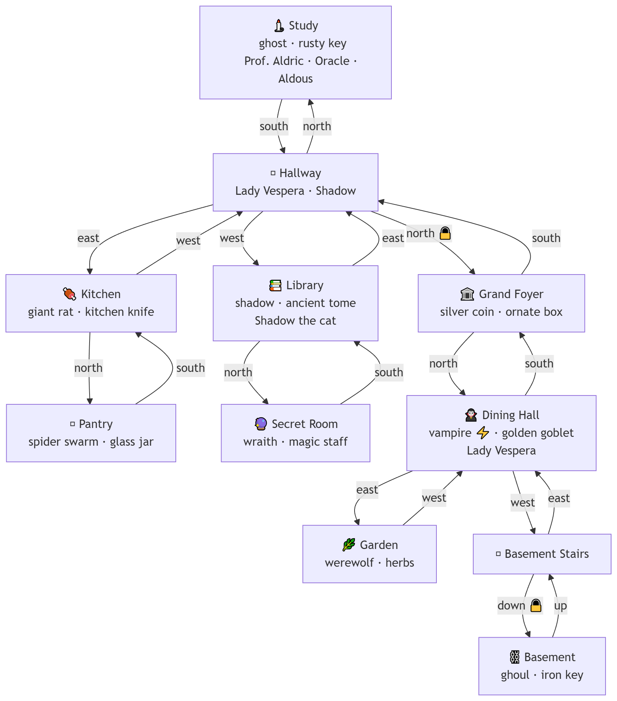

# Fun Game 02 — Text Adventure

A dark, atmospheric text adventure game built with LangGraph and OpenAI.
Explore a haunted mansion, battle monsters, collect weapons and armour,
find hidden items, trade with merchants, and converse with mysterious NPCs
— all through natural language commands powered by an LLM.

## Tech Stack

- **LangGraph** — game loop and state management
- **LangChain + OpenAI GPT-4o** — natural language command parsing, room descriptions, NPC dialogue, combat narration
- **Tavily** — real-time web search for the Oracle NPC
- **ElevenLabs** — text to speech (currently disabled)
- **Python 3.10+**

## Project Structure

```
fungame/
  data/
    rooms.json          # All room definitions, items, monsters, NPCs
    shop.json           # Merchant stock and pricing
  handlers/
    __init__.py         # Exports all action handlers
    movement.py         # Movement and door unlocking
    items.py            # Take, examine, open, equip, unequip, use
    player.py           # Inventory, room status, help display
    combat.py           # Turn-based combat loop
    dialogue.py         # NPC conversation and shop routing
    shop.py             # Merchant shop system with LangChain tools
  docs/
    mansion_map.png     # Room map diagram
  main.py               # Game state, LangGraph nodes and graph
  prompts.py            # All LLM prompts
  utils.py              # Shared utility functions
  audio_utils.py        # Text-to-speech (currently disabled)
  requirements.txt      # Python dependencies
  .env                  # API keys (not committed)
  .gitignore
  README.md
```

## Requirements

- Python 3.10+
- OpenAI API key
- Tavily API key (free tier — 1,000 searches/month free)

## Setup

### 1. Clone the repo
```bash
git clone https://github.com/YOUR_USERNAME/fungame.git
cd fungame
```

### 2. Create and activate a virtual environment
```bash
# Windows
python -m venv .venv
.venv\Scripts\activate

# Mac/Linux
python -m venv .venv
source .venv/bin/activate
```

### 3. Install dependencies
```bash
pip install -r requirements.txt
```

### 4. Create a `.env` file in the project root
```
OPENAI_API_KEY=your-openai-api-key-here
TAVILY_API_KEY=your-tavily-api-key-here
```

**Getting API keys:**
- OpenAI: https://platform.openai.com → API Keys
- Tavily: https://tavily.com → Sign up free

### 5. Run the game
```bash
python main.py
```

## Mansion Map



```
🕯️ Study ──south──> 🪞 Hallway ──north 🔒──> 🏛️ Grand Foyer ──north──> 🧛 Dining Hall
                         │                                                    │        │
                       east/west                                            east     west
                         │                                                    │        │
               🍖 Kitchen  📚 Library                                    🌿 Garden  🪜 Basement Stairs
                   │           │                                                         │
                 north       north                                                    down 🔒
                   │           │                                                         │
              🫙 Pantry   🔮 Secret Room                                           ⛓️ Basement
```

## Game Commands

The game understands natural language — just type what you want to do.
Type `help` at any time to see all commands in-game.

### Movement
| Input | Result |
|-------|--------|
| `north` / `go north` / `walk north` | Move in that direction |
| `south` / `east` / `west` / `up` / `down` | Move in that direction |
| `unlock north` | Unlock a door in that direction (if you have the key) |

### Items
| Input | Result |
|-------|--------|
| `take rusty key` / `grab the key` | Pick up an item |
| `examine old book` / `look at fireplace` | Examine something |
| `open chest` / `pry open the box` | Open a container and collect gold |
| `equip iron sword` / `wear the helmet` | Equip a weapon or armour piece |
| `unequip helmet` / `remove the cloak` | Unequip an item |
| `use health potion` / `drink potion` | Use a consumable item |

### Combat
| Input | Result |
|-------|--------|
| `attack ghost` / `fight the rat` | Enter combat with a monster |
| `attack` / `hit` | Attack during combat |
| `flee` / `run` / `escape` | Attempt to flee (60% success, returns you to previous room) |

### NPCs
| Input | Result |
|-------|--------|
| `talk to aldric` / `speak with oracle` | Start a conversation |
| `talk to aldous` / `visit the merchant` | Open the shop |
| `goodbye` / `bye` / `farewell` | End a conversation |

### Player Status
| Input | Result |
|-------|--------|
| `inventory` / `what am I carrying` | Show inventory, equipped items, armour and gold |
| `room` / `where am i` | Show full room state including hidden items and containers |
| `look` / `look around` | Re-describe the current room |
| `help` / `commands` | Show all available commands |

### Debug Commands
| Input | Result |
|-------|--------|
| `goto room_6` | Teleport to a specific room |
| `win` | Trigger the win condition |
| `quit` | Exit the game |

## Game Systems

### Combat
Turn-based combat where both player and monster attack each round. Damage is calculated from weapon stats plus a dice roll, minus monster defense. Armour reduces incoming damage by a percentage. Some monsters are aggressive and attack immediately when you enter their room — fleeing sends you back to the previous room. Monsters retain their health between encounters.

### Weapons & Armour
Weapons have a `damage` value and `weapon_type` (blade, magic, silver, blunt). Monsters have weaknesses — matching your weapon type to a monster's weakness deals bonus damage. Armour comes in four slots (helmet, chest, boots, gloves) and reduces incoming damage. Both can be found in rooms or purchased from Aldous.

### Gold & Containers
Gold is found inside containers scattered around the mansion. Open a container to automatically collect the gold inside. Gold can also be earned by defeating monsters or selling items to Aldous.

### Hidden Items
Some items are concealed behind other items or features. Examine things in the room to reveal what's hidden. Once revealed, hidden items can be picked up normally.

### Locked Doors
Some exits are locked and require a specific key. Use `unlock [direction]` to unlock a door if you're carrying the right key. Doors stay unlocked for the rest of the session.

### NPCs
Several NPCs can be found throughout the mansion. Regular NPCs engage in conversation powered by GPT-4o. The Oracle has real-time web search capability via Tavily. Aldous the Peddler runs a shop where you can buy weapons, armour, and health potions using LangChain tools for actual transactions.

### Health Potions
Health potions restore a set amount of health when used. Different potions restore different amounts. They can be found in rooms or purchased from Aldous.

## Architecture

The game is built as a LangGraph state graph. Each turn flows through these nodes:

```
START
  → load_room_data        # Load room from JSON, apply state overrides
  → describe_room         # LLM generates room description (first visit only)
  → check_aggressive      # Check if any monsters auto-attack on entry
  → get_player_action     # Wait for player input
  → resolve_action        # Parse command via LLM, dispatch to handler
  → [combat]              # Optional: turn-based combat loop
  → [npc_dialogue]        # Optional: NPC or merchant conversation
  → load_room_data        # Loop
```

State is stored in `AgentState` which tracks:
- Current room and room overrides (items taken, monsters defeated, doors unlocked)
- Player stats (health, gold, inventory, equipped weapon and armour)
- Routing flags for combat, NPC dialogue, and aggressive monster handling
- Previous room ID for flee routing

## Key Design Decisions

- **Natural language parsing** — player input is parsed by GPT-4o into structured actions rather than keyword matching
- **Inventory stores full item dicts** — not just strings, so weapon/armour/potion stats are always available
- **Room state overrides** — base room data lives in JSON, changes (items taken, monsters wounded, doors unlocked) are stored as overrides in game state
- **LangChain tools for the shop** — Aldous uses an agentic tool-calling loop to process real transactions in character
- **Two-step web search** — the Oracle uses Tavily for raw facts then GPT-4o to deliver them in character
- **Aggressive monsters** — some monsters auto-attack on room entry and block progress until defeated
- **Persistent monster health** — wounded monsters retain their health between encounters

## Adding Content

### Add a new room
Edit `data/rooms.json` — add a new room entry and connect it via `exits` in an existing room. Add `locked_exits` if the door requires a key.

### Add a new NPC
Add an NPC dict to a room's `npcs` list in `rooms.json`. Set `can_search_web: true` to give them Tavily access. Set `shop_id` to connect them to a merchant shop.

### Add a new merchant
Add a new entry to `data/shop.json` and set `shop_id` on the NPC to match.

### Add a new action
1. Add the action rule to `COMMAND_PARSER_PROMPT` in `prompts.py`
2. Write a handler function in the appropriate `handlers/` file
3. Export it from `handlers/__init__.py`
4. Add it to the `handlers` dict in `resolve_action` in `main.py`

### Add a new monster
Add a monster dict to a room's `monsters` list in `rooms.json`. Set `aggressive: true` to make it auto-attack on room entry.

## Branches

| Branch | Description |
|--------|-------------|
| `main` | Stable terminal version |
| `web-app` | Web browser version (in progress) |

## Branch Commands
```bash
# Switch branches
git checkout main
git checkout web-app

# Create a new branch
git checkout -b branch-name

# Save and push changes
git add .
git commit -m "describe your change"
git push origin main
```

## Notes

- Game state is not persisted between sessions — each run starts fresh
- All LLM calls use `GAME_SYSTEM_PROMPT` for consistent gothic tone
- The Oracle NPC uses real web search — each question costs one Tavily API credit
- OpenAI costs accrue per session — monitor usage at platform.openai.com/usage
- Aggressive monsters retain wounded health between room visits
- Flee from combat always returns you to the previous room
