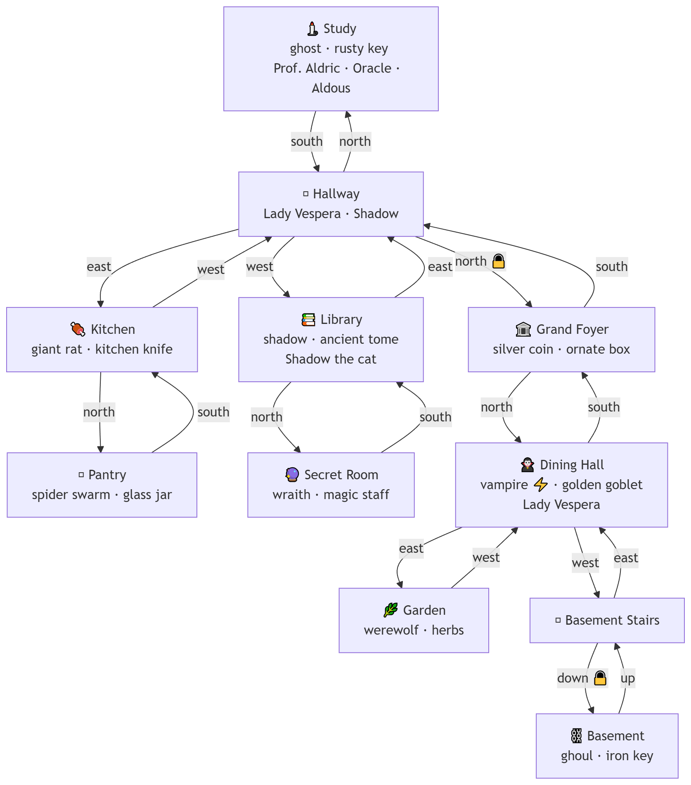
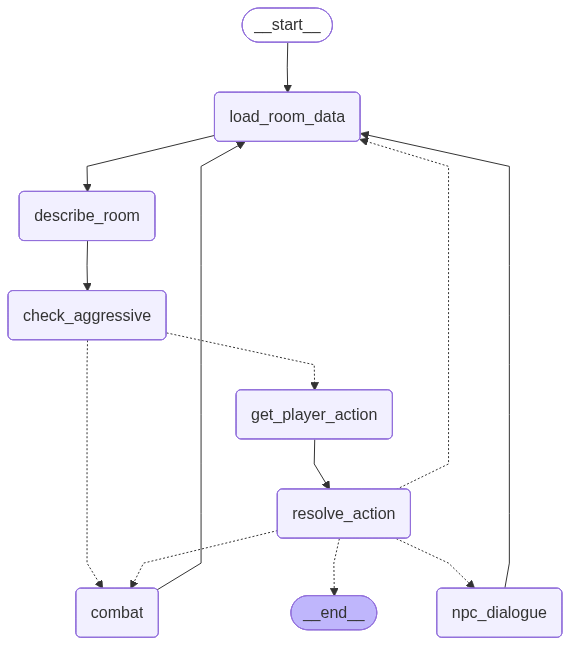

# AI Driven Haunted Mansion

A dark, atmospheric text adventure game built with LangGraph and OpenAI.
Explore a haunted mansion, battle monsters, collect weapons and armour,
find hidden items, trade with merchants, and converse with mysterious NPCs
— all through natural language commands powered by an LLM.

## AI Techniques

| Technique | Where Used |
|-----------|------------|
| **RAG (Retrieval-Augmented Generation)** | NPC memory — facts extracted from conversations are stored as vector embeddings in Pinecone and retrieved at query time to give NPCs long-term memory |
| **HyDE (Hypothetical Document Embeddings)** | Memory retrieval — player queries are rewritten as one or more hypothetical factual statements before embedding. Set `HYDE_NUM_DOCUMENTS` in `npc_memory.py` to generate multiple reformulations and average their embeddings for richer semantic search |
| **LLM-as-judge** | Mood and fear scoring — GPT-4o-mini rates player attitude and threat level after every message as an unconstrained integer |
| **Tool calling (function calling)** | Merchant shop — Aldous uses a LangChain agentic loop with bound tools (`get_shop_stock`, `buy_item`, `sell_item`, etc.) to process real transactions in character |
| **ReAct-style agentic loop** | Oracle NPC — the model is given a `web_search` tool and decides autonomously whether to call it (zero or more times) before replying. No separate routing classifier; the model reasons and acts in one pass |
| **Prompt injection via system message** | NPC emotional state — mood and fear behavioural overrides are appended to the system message so they carry authority over personality descriptions in the human turn |
| **LangGraph state graph** | Game loop — the entire game is a compiled state graph with conditional edges routing between room loading, combat, dialogue, and player input nodes |
| **Per-exchange fact extraction** | NPC memory — after every player/NPC exchange, GPT-4o-mini extracts discrete facts about the player and upserts them as separate vector embeddings |
| **Short-term coreference resolution** | Command parsing — the last entity the player interacted with (item, NPC, monster) is tracked in game state and injected into the command parser, so pronouns like "it", "him", "them" resolve correctly across consecutive commands |
| **Streaming LLM output** | Room descriptions, NPC dialogue, combat narration, examine — tokens are streamed to the browser as generated via LangChain `.stream()` and WebSocket token messages, so text appears as it's written rather than after a full wait |
| **NPC gossip network** | Facts learned in one conversation propagate to other NPCs via a directed social graph. After each exchange, gossip-worthy facts are filtered by GPT-4o-mini and pushed to connected NPCs' Pinecone namespaces with attribution, so Lady Vespera can reference what the player told Aldric |
| **Gossip emotional impact** | Rumours an NPC has heard about the player shift their mood and fear before the conversation starts. `evaluate_gossip_impact()` queries the NPC's Pinecone namespace at greeting time and asks GPT-4o-mini to rate the emotional effect — arriving with a bad reputation has immediate consequences |
| **NPC knowledge graph** | Each NPC has a `knows_about` dict in `npcs.json` mapping namespaced entity keys (`npc:`, `monster:`, `item:`) to private supplemental knowledge. At conversation start, descriptions are pulled from the relevant catalogue and injected into the NPC's knowledge string alongside any secret they hold about that entity |
| **Conversation openings** | NPCs greet the player when approached using a live LLM call that incorporates current mood, fear, and retrieved memories — the opening line varies based on your relationship history |
| **LLM-evaluated gift triggers** | Some NPCs hold a hidden item or secret they will only reveal if the player says the right thing — a code phrase, a legend, an acknowledgement. GPT-4o-mini evaluates every player message against the NPC's trigger condition, allowing natural phrasings rather than exact keyword matching |
| **LLM-generated journal** | Notable events (secrets learned, items received from NPCs, trades) are summarised into 2-sentence gothic journal entries by GPT-4o-mini — first sentence states what happened, second gives a concrete hint for what to do next |

## LLM Calls

Every LLM call in the game uses one of two OpenAI models. `gpt-4o` handles all player-facing narrative; `gpt-4o-mini` handles all background evaluation and memory operations.

| Purpose | Model |
|---|---|
| Room description | gpt-4o |
| Win epilogue | gpt-4o |
| NPC dialogue | gpt-4o |
| NPC bribe reaction | gpt-4o |
| Oracle web search | gpt-4o |
| Shop merchant (Aldous) | gpt-4o |
| Combat narration | gpt-4o |
| Flee narration | gpt-4o |
| Item examination | gpt-4o |
| Command parsing | gpt-4o-mini |
| Room features (cheat modal) | gpt-4o-mini |
| Bribe mood evaluation | gpt-4o-mini |
| Fact extraction from exchanges | gpt-4o-mini |
| Gossip filtering | gpt-4o-mini |
| HyDE query rewrite | gpt-4o-mini |
| Threat evaluation (fear delta) | gpt-4o-mini |
| Mood delta evaluation | gpt-4o-mini |
| Gossip impact on NPC mood/fear | gpt-4o-mini |
| Gift trigger evaluation | gpt-4o-mini |
| Journal entry generation | gpt-4o-mini |

## Tech Stack

- **LangGraph** — game loop and state management
- **LangChain + OpenAI GPT-4o** — room descriptions, NPC dialogue, win narration
- **OpenAI GPT-4o-mini** — command parsing, combat narration, item examination, shop, NPC memory operations
- **Pinecone** — vector database for NPC memory (RAG)
- **Tavily** — real-time web search for the Oracle NPC
- **FastAPI + WebSockets** — web server and real-time browser communication
- **ElevenLabs** — text to speech (currently disabled)
- **Python 3.10+**

## Project Structure

```
fungame/
  data/
    rooms.json          # Room definitions — layout, exits, items (monsters/NPCs referenced by ID)
    monsters.json       # Monster catalogue — stats, description, behavior (keyed by ID)
    npcs.json           # NPC catalogue — personality, memory config, gossip graph, knows_about (keyed by ID)
    items.json          # Item descriptions catalogue — used by knows_about lookups (keyed by slug)
    shop.json           # Merchant stock and pricing
  handlers/
    __init__.py         # Exports all action handlers
    movement.py         # Movement and door unlocking
    items.py            # Take, examine, open, equip, unequip, use
    player.py           # Inventory, room status, help display
    combat.py           # Turn-based combat loop
    dialogue.py         # NPC conversation and shop routing
    shop.py             # Merchant shop system with LangChain tools
  static/
    index.html          # Web UI (gothic theme, room images, map + inventory sidebar)
    rooms/              # Pre-generated DALL-E 3 room images (one PNG per room)
  scripts/
    generate_room_images.py  # Generate/regenerate DALL-E 3 room images
  docs/
    mansion_map.png     # Room map diagram
  main.py               # Game state, LangGraph nodes and graph
  server.py             # FastAPI WebSocket server (web UI entry point)
  io_context.py         # I/O abstraction layer (CLIContext / WebSocketContext)
  prompts.py            # All LLM prompts
  utils.py              # Shared utility functions
  audio_utils.py        # Text-to-speech (currently disabled)
  requirements.txt      # Python dependencies
  .env                  # API keys (not committed)
  .gitignore
  README.md
```

## Requirements

- Python 3.10+
- OpenAI API key
- Tavily API key (free tier — 1,000 searches/month free)
- Pinecone API key (free tier — create an index named `fungame-npc-memory`, dimensions: 1536, metric: cosine)

## Setup

### 1. Clone the repo
```bash
git clone https://github.com/YOUR_USERNAME/fungame.git
cd fungame
```

### 2. Create and activate a virtual environment
```bash
# Windows
python -m venv .venv
.venv\Scripts\activate

# Mac/Linux
python -m venv .venv
source .venv/bin/activate
```

### 3. Install dependencies
```bash
pip install -r requirements.txt
```

### 4. Create a `.env` file in the project root
```
OPENAI_API_KEY=your-openai-api-key-here
TAVILY_API_KEY=your-tavily-api-key-here
PINECONE_API_KEY=your-pinecone-api-key-here
```

**Getting API keys:**
- OpenAI: https://platform.openai.com → API Keys
- Tavily: https://tavily.com → Sign up free
- Pinecone: https://pinecone.io → Sign up free → Create index named `fungame-npc-memory` (dimensions: 1536, metric: cosine)

### 5. Run the game

**Terminal (CLI):**
```bash
python main.py
```

**Web browser (Windows — recommended):**
```powershell
.\run_live.ps1
```
Prints your local and network URLs, then starts the server.

**Web browser (manual):**
```bash
# Windows PowerShell
$env:PYTHONUTF8=1; uvicorn server:fastapi_app --port 8765

# Mac/Linux
PYTHONUTF8=1 uvicorn server:fastapi_app --port 8765
```
Then open `http://localhost:8765` in your browser.

> **Development tip:** add `--reload` to auto-restart the server on file changes: `uvicorn server:fastapi_app --port 8765 --reload`

## Mansion Map



```
🕯️ Study ──south──> 🪞 Hallway ──north 🔒──> 🏛️ Grand Foyer ──north──> 🧛 Dining Hall
                         │                                                    │        │
                       east/west                                            east     west
                         │                                                    │        │
               🍖 Kitchen  📚 Library                                    🌿 Garden  🪜 Basement Stairs
                   │           │                                                         │
                 north       north                                                    down 🔒
                   │           │                                                         │
              🫙 Pantry   🔮 Secret Room                                           ⛓️ Basement
```

## Game Commands

The game understands natural language — just type what you want to do.
Type `help` at any time to see all commands in-game.

### Movement
| Input | Result |
|-------|--------|
| `north` / `go north` / `walk north` | Move in that direction |
| `south` / `east` / `west` / `up` / `down` | Move in that direction |
| `unlock north` | Unlock a door in that direction (if you have the key) |

### Items
| Input | Result |
|-------|--------|
| `take rusty key` / `grab the key` | Pick up an item |
| `examine old book` / `look at fireplace` | Examine something |
| `open chest` / `pry open the box` | Open a container and collect gold |
| `equip iron sword` / `wear the helmet` | Equip a weapon or armour piece |
| `unequip helmet` / `remove the cloak` | Unequip an item |
| `use health potion` / `drink potion` | Use a consumable item |

### Combat
| Input | Result |
|-------|--------|
| `attack ghost` / `fight the rat` | Enter combat with a monster |
| `attack` / `hit` | Attack during combat |
| `flee` / `run` / `escape` | Attempt to flee (60% success, returns you to previous room) |

### NPCs
| Input | Result |
|-------|--------|
| `talk to aldric` / `speak with oracle` | Start a conversation |
| `talk to aldous` / `visit the merchant` | Open the shop |
| `give 20 gold to aldric` / `offer 50 gold` | Bribe an NPC to improve their mood |
| `give [item] to [npc]` | Offer an item — some NPCs will trade it for something valuable |
| `goodbye` / `bye` / `farewell` | End a conversation |

### Player Status
| Input | Result |
|-------|--------|
| `inventory` / `what am I carrying` | Show inventory, equipped items, armour and gold |
| `room` / `where am i` | Show full room state including hidden items and containers |
| `look` / `look around` | Re-describe the current room |
| `help` / `commands` | Show all available commands |

### Debug Commands
| Input | Result |
|-------|--------|
| `goto room_6` | Teleport to a specific room |
| `win` | Trigger the win condition |
| `cheat gold` | Add 100 gold (works anywhere, including the shop) |
| `cheat kill` | Instantly defeat the current monster (combat only) |
| `clearmemory` | Wipe all NPC memories mid-session |
| `quit` | Exit the game |

> **Tip:** Click the **CHEAT** button in the top bar for a debug panel with a gold button, a kill button, and a live list of all AI techniques active in your current room.

## Game Systems

### Combat
Turn-based combat where both player and monster attack each round. Damage is calculated from weapon stats plus a dice roll, minus monster defense. Armour reduces incoming damage by a percentage. Some monsters are aggressive and attack immediately when you enter their room — fleeing sends you back to the previous room. Monsters retain their health between encounters.

### Weapons & Armour
Weapons have a `damage` value and `weapon_type` (blade, magic, silver, blunt). Monsters have weaknesses — matching your weapon type to a monster's weakness deals bonus damage. Armour comes in four slots (helmet, chest, boots, gloves) and reduces incoming damage. Both can be found in rooms or purchased from Aldous.

### Gold & Containers
Gold is found inside containers scattered around the mansion. Open a container to automatically collect the gold inside. Gold can also be earned by defeating monsters or selling items to Aldous.

### Hidden Items
Some items are concealed behind other items or features. Examine things in the room to reveal what's hidden. Once revealed, hidden items can be picked up normally.

### Locked Doors
Some exits are locked and require a specific key. Use `unlock [direction]` to unlock a door if you're carrying the right key. Doors stay unlocked for the rest of the session.

### NPCs
Several NPCs can be found throughout the mansion. Most NPCs open the conversation themselves when you approach — their greeting reflects their personality, current mood, and any memories they hold about you. Regular NPCs engage in conversation powered by GPT-4o. The Oracle waits silently for you to speak first. Aldous the Peddler runs a shop where you can buy weapons, armour, and health potions using LangChain tools for actual transactions.

### NPC Emotional State
Every NPC tracks two independent emotional scores that persist across conversations within a session:

**Mood (-100 to +100)** — how much the NPC likes the player. Shifts based on tone: friendly messages push it positive, rude or dismissive ones push it negative. Affects how forthcoming or cold the NPC is in replies.

**Fear (0 to 100)** — how threatened the NPC feels. Shifts based on threatening language or aggressive behaviour. A frightened NPC becomes submissive and over-helpful; a terrified one may volunteer information they'd normally withhold.

Both scores are evaluated by GPT-4o-mini after each message and injected into the system prompt as behavioural overrides, so they influence every response. The scores are independent — an NPC can dislike you but still fear you, producing a different dynamic than one who is simply hostile.

**Aldous and prices** — Aldous's shop prices shift based on his mood and fear scores. Being friendly earns discounts; being rude raises prices. Threatening him produces the steepest discounts of all.

**The Oracle and web search** — if the Oracle's mood drops low enough, she refuses to use her powers for you and delivers an in-character refusal instead of searching the web.

**Bribing NPCs** — offer gold to improve an NPC's mood. Say `give 20 gold to aldric` at any time, including mid-conversation. The mood boost is evaluated by GPT-4o-mini based on the NPC's personality and current mood — a greedy merchant responds very differently to 50 gold than a proud scholar.

### NPC Memory
NPCs remember what you tell them across conversations using a RAG (Retrieval-Augmented Generation) pipeline backed by Pinecone.

**How it works:**
1. After each exchange, key facts about the player are extracted by GPT-4o-mini and stored as vector embeddings in Pinecone, in a separate namespace per NPC
2. At each player message, the query is rewritten using HyDE (Hypothetical Document Embeddings) to improve semantic search accuracy. By default, one reformulation is generated; you can configure this in `npc_memory.py`:
   - `HYDE_NUM_DOCUMENTS = 1` — single rewrite (default, token-efficient)
   - `HYDE_NUM_DOCUMENTS = 3` — generates 3 reformulations and averages embeddings (richer search, higher cost)
   - Call `_hyde_rewrite(query, npc_name, num_documents=N)` to override per-query
3. Top matching memories are retrieved and injected into the NPC's prompt so they can reference past conversations naturally

**Example:** Tell Professor Aldric your name in one session, come back later and ask "do you know who I am?" — he'll remember.

**Memory is wiped at the start of every new game.** Use the `clearmemory` debug command to wipe manually mid-session.

### NPC Gossip Network
Facts you share in one conversation can spread to other NPCs through a directed social graph defined in `npcs.json` via `gossips_with`.

After each exchange, gossip-worthy facts (player name, goals, monsters killed) are filtered by GPT-4o-mini — bribe amounts, threats, and small talk are stripped — then pushed to connected NPCs' Pinecone namespaces with attribution: `"Rumour (from Aldric): Player is searching for the vampire"`.

The next time you talk to a connected NPC, they retrieve that rumour during memory lookup and can reference it naturally. The Oracle is isolated by design. Shadow the cat gossips with everyone.

Rumours also affect the NPC's **emotional state before you speak**. When a conversation starts, the NPC's gossip memories are queried and rated by GPT-4o-mini for mood and fear impact. Arriving with a dangerous reputation makes NPCs fearful from the first word; being known as generous makes them warmer.

The Oracle uses a ReAct-style tool-calling loop — she is given a `web_search` tool and decides herself whether to use it, and can search multiple times if the first result is insufficient. No separate routing classifier is needed.

### NPC Knowledge Graph
Each NPC can be given structured knowledge of other characters, monsters, and items through a `knows_about` dict in `npcs.json`. Keys are namespaced by type (`npc:`, `monster:`, `item:`) and the value is private supplemental knowledge — suspicions, secrets, or personal history that isn't part of the entity's public description.

```json
"knows_about": {
  "npc:lady_vespera": "Believes she has lived in this mansion for centuries and is not entirely human.",
  "monster:ghost": "Recognises the ghost as a former colleague. Will not say how the colleague died.",
  "item:rusty_key": "Knows precisely what it opens but refuses to say directly."
}
```

At conversation start, descriptions are pulled from the relevant catalogue (`npcs.json`, `monsters.json`, `items.json`) and injected into the NPC's knowledge string. Empty value = description only; non-empty value = appended as private knowledge the NPC holds but may or may not reveal.

### NPC Gifts
Some NPCs hold a hidden item or secret they will only give up if the player says the right thing — a code phrase, an oath, or an acknowledgement of something the NPC needs to hear. GPT-4o-mini evaluates each message against the trigger condition, so natural phrasings work ("I know what lies beneath" and "knowledge demands descent" can both satisfy the same trigger). Each gift is one-time only.

### NPC Trades
Some NPCs will exchange something valuable for a specific item. Offer an item during conversation (`give strange amulet to lady vespera`). If the NPC wants it, they accept it and give back an item, gold, a secret, or a combination. If they have no use for it, they reject it in character. Each trade is one-time only.

### Journal
Notable events are automatically recorded in a **Journal** tab in the sidebar. Entries are generated by GPT-4o-mini: one sentence stating plainly what happened, one sentence giving a concrete hint for what to do next. Gothic tone, but never cryptic — the journal is meant to help. Room discoveries ("Discovered: Basement Stairs") are logged as simple entries without an LLM call. New entries show an unread badge on the tab.

### Health Potions
Health potions restore a set amount of health when used. Different potions restore different amounts. They can be found in rooms or purchased from Aldous.

## Hosted Demo

> 🌐 **Live demo:** `[ADD URL HERE]`
>
> _Hosted on [Railway](https://railway.app) — to run your own copy see Setup below._

---

## Web UI

The game runs in the browser via a FastAPI WebSocket server. The UI features:

- **Gothic dark theme** with atmospheric typography
- **Room images** — DALL-E 3 generated artwork for each room, fading in as you move (pre-generated, zero runtime cost)
- **D&D-style map** — always visible sidebar panel showing rooms in correct positional layout (N/S/E/W), colour-coded by content (amber = current, red = monsters, blue = NPCs); click any room to navigate there instantly; hover tooltip shows contents
- **Sidebar tabs** — Inventory (live equipment/item list), Journal (auto-written event log), Shop (appears during merchant encounters), Debug (raw server messages)
- **Journal tab** — LLM-generated entries for secrets, trades, and room discoveries; unread badge when new entries arrive
- **Help modal** — command reference available via the HELP button in the header
- **Loading indicator** — "The mansion stirs..." animated prompt while the AI generates a response

### Generating room images

Images are pre-generated and committed. To regenerate:

```bash
python scripts/generate_room_images.py           # all rooms (~$0.44, ~2.5 min)
python scripts/generate_room_images.py --room room_3   # single room
python scripts/generate_room_images.py --overwrite     # force regenerate
```

### How the CLI game becomes a web app

The game engine (`main.py`) was originally a pure terminal app — it printed text and read from stdin. Turning it into a web app without rewriting the game logic required solving three problems:

**1. Abstracting I/O (`io_context.py`)**
Every `print` and `input` call in the game was replaced with `io_ctx().send(text)` and `io_ctx().get_input()`. `io_ctx()` returns whatever I/O driver is registered for the current session:
- `CLIContext` → wraps `print` / `input` (terminal mode, `python main.py`)
- `WebSocketContext` → wraps async queues (web mode, `uvicorn server:fastapi_app`)

The game code itself never changes — only the driver does. This is a [ports and adapters](https://alistair.cockburn.us/hexagonal-architecture/) pattern.

**2. Bridging sync game ↔ async server (`server.py`)**
LangGraph's game loop is **synchronous** (it blocks waiting for player input). FastAPI is **async** (it can't block). The bridge:
- Each WebSocket connection spawns the game in a **thread** via `ThreadPoolExecutor`
- Game output flows through an `asyncio.Queue` (thread → WebSocket)
- Player input flows through a `threading.Queue` (WebSocket → thread)
- A `contextvars.ContextVar` gives each game thread its own I/O driver so concurrent sessions don't interfere

**3. Structured state messages**
Plain text output is fine for a terminal, but the browser needs to know health, gold, inventory, and room ID to render the sidebar and map. After every action the game emits a `__statejson__` message alongside the narrative text. The browser parses this to update the UI panels; the narrative text goes into the scrolling output unchanged.

```
Browser  ←──── ws ────────────────────────────────  FastAPI
                │  {type:"message", text:"..."}      │  ← narrative text
                │  {type:"state", gold:50, ...}       │  ← UI data
                │  {type:"encounter_start", ...}      │  ← combat/dialogue panel
                └──── plain text ────────────────→   │  player input
```

## Architecture

The game is built as a LangGraph state graph. Each turn flows through these nodes:



Solid edges are unconditional transitions; dashed edges are conditional — `check_aggressive` can jump straight to `combat` if a monster auto-attacks on entry, and `resolve_action` routes to `combat`, `npc_dialogue`, or `__end__` depending on what the player did. Everything loops back to `load_room_data` after each action.

```
START
  → load_room_data        # Load room from JSON, apply state overrides
  → describe_room         # LLM generates room description (first visit only)
  → check_aggressive      # Check if any monsters auto-attack on entry
  → get_player_action     # Wait for player input
  → resolve_action        # Parse command via LLM, dispatch to handler
  → [combat]              # Optional: turn-based combat loop
  → [npc_dialogue]        # Optional: NPC or merchant conversation
  → load_room_data        # Loop
```

State is stored in `AgentState` which tracks:
- Current room and room overrides (items taken, monsters defeated, doors unlocked)
- Player stats (health, gold, inventory, equipped weapon and armour)
- Routing flags for combat, NPC dialogue, and aggressive monster handling
- Previous room ID for flee routing
- NPC mood scores (`npc_moods`) and fear scores (`npc_fear`) per NPC name
- NPC gift and trade completion tracking (`npc_gifts_given`, `npc_trades_done`) so rewards fire only once
- Visited rooms (`rooms_visited`) for first-visit journal entries

## Key Design Decisions

- **Natural language parsing** — player input is parsed by GPT-4o into structured actions rather than keyword matching
- **Inventory stores full item dicts** — not just strings, so weapon/armour/potion stats are always available
- **Room state overrides** — base room data lives in JSON, changes (items taken, monsters wounded, doors unlocked) are stored as overrides in game state
- **LangChain tools for the shop** — Aldous uses an agentic tool-calling loop to process real transactions in character
- **ReAct-style Oracle** — the Oracle is given a `web_search` tool and reasons autonomously about when to use it; no routing classifier needed
- **NPC memory via RAG** — facts extracted per exchange, embedded and stored in Pinecone per NPC namespace, retrieved via HyDE-rewritten semantic search
- **Dynamic web search** — the Oracle decides per message whether to call `web_search` (and how many times), handled autonomously inside the tool-calling loop
- **NPC emotional state** — dual-axis mood/fear system evaluated by GPT-4o-mini after every message; scores are injected as system-level behavioural overrides
- **Gold bribing** — mood boosts from bribes are LLM-evaluated based on NPC personality and current attitude, not a fixed formula
- **Aggressive monsters** — some monsters auto-attack on room entry and block progress until defeated
- **Persistent monster health** — wounded monsters retain their health between encounters

## Adding Content

### Add a new room
Edit `data/rooms.json` — add a new room entry and connect it via `exits` in an existing room. Add `locked_exits` if the door requires a key.

### Add a new NPC
1. Add a definition to `data/npcs.json` with a unique key. Set `can_search_web: true` for Tavily access, `shop_id` to connect to a merchant, `opens_conversation: false` to make them wait silently, `gossips_with: [...]` with NPC names they share rumours with, and `knows_about: {"npc:<id>": "secret", "monster:<id>": "", "item:<id>": "secret"}` for structured entity knowledge.
2. Reference the key in the room's `npcs` list in `data/rooms.json`.

### Add a new merchant
Add a new entry to `data/shop.json` and set `shop_id` on the NPC definition to match.

### Add an NPC gift (say the right thing)
Add a `gift` field to an NPC in `data/npcs.json`. At least one of `item_name` or `secret` is required:
```json
"gift": {
  "item_name": "iron key",
  "secret": "The creature below has been waiting for decades.",
  "trigger_description": "Player speaks the scholar's oath or shows they understand the cost of descending"
}
```

### Add an NPC trade (give an item)
Add a `trades` list to an NPC in `data/npcs.json`. Each trade fires once:
```json
"trades": [
  {
    "required_item": "magic staff",
    "item_name": "enchanted crossbow",
    "gold": 80,
    "secret": "A secret revealed when the trade completes."
  }
]
```

### Add a new action
1. Add the action rule to `COMMAND_PARSER_PROMPT` in `prompts.py`
2. Write a handler function in the appropriate `handlers/` file
3. Export it from `handlers/__init__.py`
4. Add it to the `handlers` dict in `resolve_action` in `main.py`

### Add a new monster
1. Add a definition to `data/monsters.json` with a unique key. Include `description` (appearance) and `behavior` (how it fights). Set `aggressive: true` to make it auto-attack on room entry.
2. Reference the key in the room's `monsters` list in `data/rooms.json`.

## Notes

- Game state is not persisted between sessions — each run starts fresh
- All LLM calls use `GAME_SYSTEM_PROMPT` for consistent gothic tone
- The Oracle NPC uses real web search — each question costs one Tavily API credit
- OpenAI costs accrue per session — monitor usage at platform.openai.com/usage
- Aggressive monsters retain wounded health between room visits
- Flee from combat always returns you to the previous room
